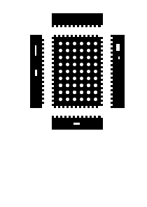

# I built a case for my T-Deck

Today I built a case for my T-Deck. I designed it for 3mm acrylic in Inkscape (this was my first time using it) and laser-cut it at the hackerspace.

I had to re-cut the top and bottom pieces, but after that, all I had to do was trim the hot glue, and it fit together fine.

To be clear, the pieces are stuck together by some kind of glue/welder for acrylic, not friction.

I do have some small problems:
- I need to use a screw to toggle the power switch (I may make a piece to attach to it).
- I need to use a pin to press the reset button.

Besides that, this works well and looks nice.

## Pictures

### Back

### Right

### Front

### SVG file

