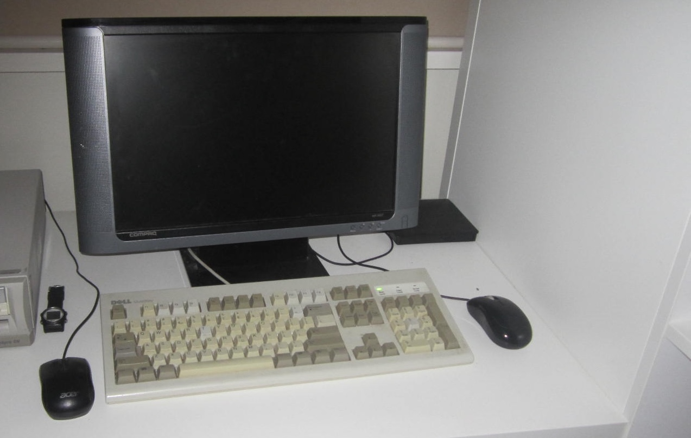

# I got a Compaq Deskpro
Yesterday I got a Compaq Deskpro from an e-waste disposal.

When I got home, I examined it a bit further, and I saw a Windows 98 SE sticker on the side.
The model is a Compaq Deskpro EN, with a Pentium III at 667Mhz and 128MB of RAM.

I plugged it into my CRT, it booted fine, besides for the missing hard drive and empty CMOS battery.
I reorganised my desk setup and put it into place.

I replaced the CMOS battery, a CR 2032, with a CR 2025 battery, and I got a few 40GB IDE hard drives from my local Hackerspace.
I don't have a PS/2 mouse yet (I'll get one next week), so although the BeOS install CD booted, it was not particularly useful.
Instead, I installed FreeDOS. (I'll install BeOS when I get that mouse)
This machine has a builtin sound card, speaker, video card, and network card, two usb ports, two serial ports, a parallel port, and PS/2 mouse and keyboard ports.

Inside, this is quite a nice machine to work with. It is easy to access all the componts without any screws, and I installed a RTL8139 PCI network card for compatibility with BeOS without any trouble.

Finally, I will leave you with some more pictures of my desk setup.

#### The Deskpro with my CRT

#### The other side

