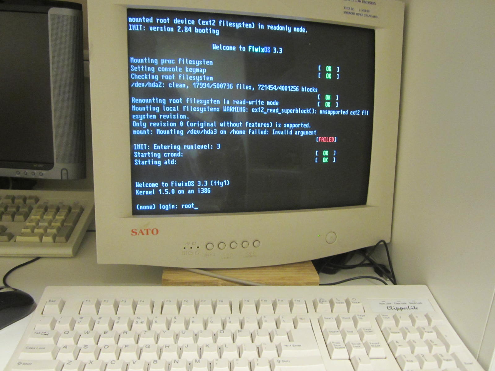

# Installing Fiwix OS on my old laptop

I wanted to install [Fiwix OS](https://fiwix.org) on my old laptop.

It's from 1999, has 64MB of RAM, a 4.6G HD, no screen, partly broken keyboard, and cost me $5 at a swap meet.

So, Fiwix can't boot see the CDROM drive on it for some reason (possible a weird IDE configuration),
but I wanted to install it.

I went to `#fiwix` on libera.chat, and asked for help.
Mikaku had the idea to connect the disk to a different machine with and USB-to-IDE cable. I didn't have one, so I decided to connect it internally to a different machine.
I took it out, and... it was 2.5" IDE drive, which I do not have an adapter for.

So, I thought for a bit, and hit upon the idea of using dd.
First, I used dd to backup the HD onto a USB (onto a file in a BFS partition (I was using BeOS)).
Then I copied the image from the USB to an external NTFS HDD in Haiku.

I first thought to just create an image the same size as the HD, but to play it safe, I installed on to a copy of the HD backup image.
Then, I copied the installed image to an ext2 USB, and I used a Linux LiveCD to dd the image on the USB to the HD.

After a while, dd finished, I rebooted, and... it worked.

Also, as a bonus, I fixed the PS/2 keyboard that I had found with my CRT.

