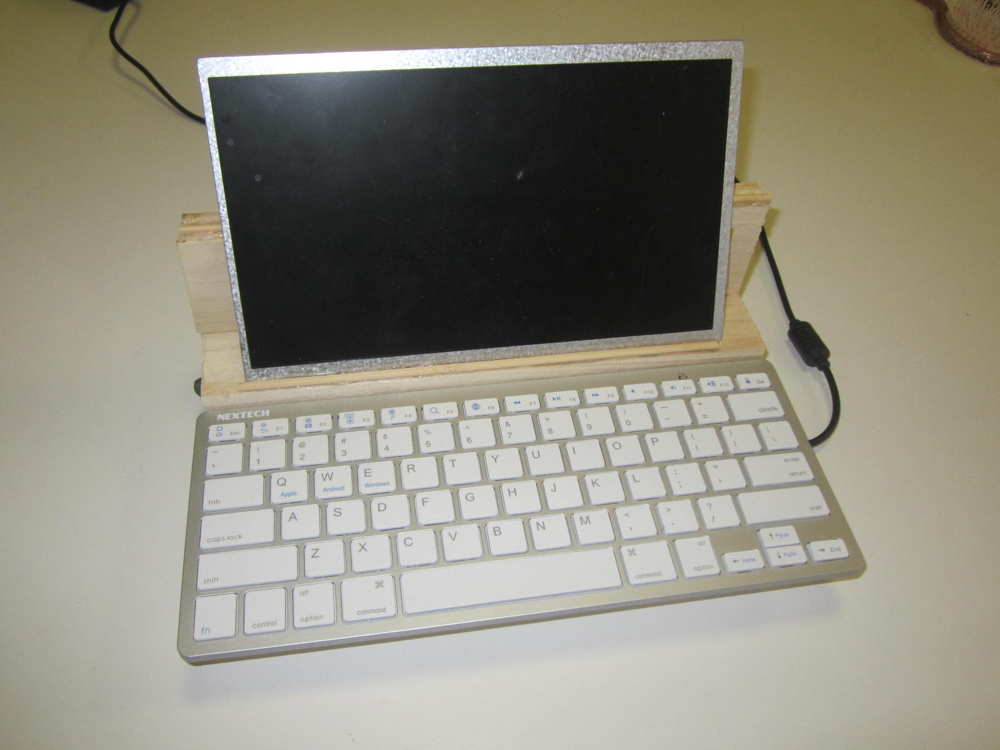
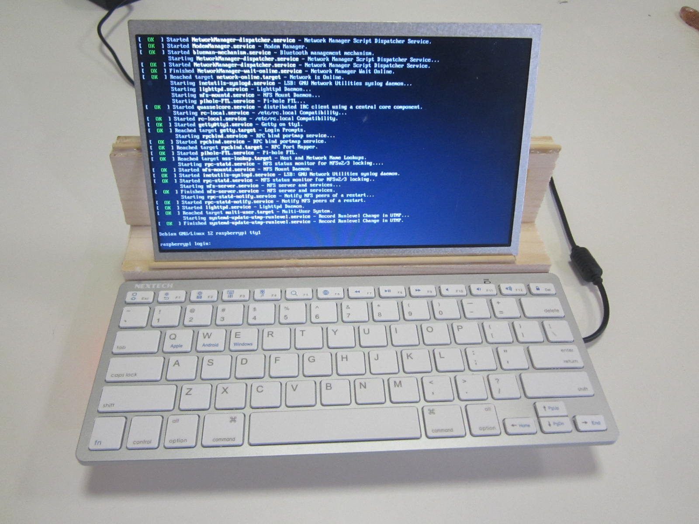

# My new cyberdeck
Today I built a cyberdeck, out of the remains of my previous [attempt](https://discuss.haiku-os.org/t/i-built-a-raspberry-pi-tablet/14266).

The computer is a Raspberry Pi 4B with 8GB of RAM, and uses a power supply, display controller, and screen from it's [first home](https://www.jaycar.com.au/p/XC9064).
The [keyboard](https://www.jaycar.com.au/p/XC5138) is a fairly generic blutooth one, and is removable from the main body.

Possible improvements could be adding speakers, and a battery.

Now, for the pictures.

#### Cyberdeck

#### Back

#### Keyboard removed

#### Booting...

#### Login

#### Neofetch

